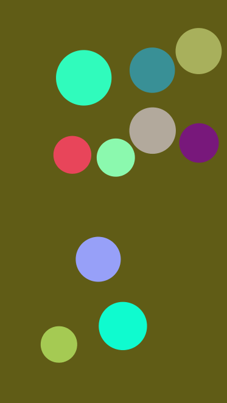

# [ball-collision](https://www.npmjs.com/package/@eleven.fe/ball-collision)

小球撞击动画，canvas 绘制。

## Introduction

- 纯 js 库

- 支持 typescript

- canvas、window.requestAnimationFrame 绘制动画。

  移动端对 canvas、window.requestAnimationFrame 的兼容性较好，一般不用担心。具体的兼容性细节如下：

  1. canvas 兼容 IE 9 及 9 以上；
  2. requestAnimationFrame 兼容 IE 10 及 10 以上（如果有需要，可以自行引入 [raf](https://github.com/chrisdickinson/raf) 增强兼容性，示例：在全局代码比较早的位置 `import 'raf/polyfill'`）；

- canvas 在移动端高清屏的模糊问题内部已处理，不会有图片模糊的困扰。

- 针对移动端所有尺寸屏幕，内部实现了类似 REM 的缩放机制，会自动做缩放处理。

  如果需要在 PC 端关闭缩放效果（移动端不支持关闭缩放），请配置 `scaleInPC` 参数为 false。

- 如果你的页面并不总是与设备屏幕等宽，例如：你的移动端页面，在 PC 端展示时，有设置最大宽度、剩余空间留白。

  那么此时，你必须要配置 `docEl` 参数，该参数的 clientWidth 应当等于实际的页面宽度。（否则 canvas 画布会与页面等宽，样式展示上会有偏差。）

- 可以使用参数 `designWidth`（默认：375）指定设计稿，小球的半径、圆心位置等数值，均是指定设计稿中的数值。

- 浏览器 resize 或移动端 orientationchange 事件触发时，默认会重新绘制。

  默认情况下，仅浏览器窗口的宽度变化时触发重新绘制。配置参数 `resetOnlyWidth: false` 将会在宽、高任意有变化时重新绘制。画布的大小仅与窗口宽度关联是，建议开启。

  配置参数 `resetOnResize: false` 可以移除窗口变化时重新绘制。画布的宽、高与窗口大小无关联时，建议关闭。

## Example

1. 气泡撞击

   [example/index.html](./example/index.html)

   

2. 位置、背景色、尺寸等全随机

   [example/random.html](./example/random.html)

   

## Installation

yarn

```sh
yarn add @eleven.fe/ball-collision
```

npm

```sh
npm i @eleven.fe/ball-collision
```

## Options

```ts
interface CollisionConfig {
  /** 画板 HTMLElement */
  canvas: HTMLCanvasElement | any;
  /** 指定的小球集合，允许单独指定配置 */
  balls: BallSetting[];
  /** 最小位移速度，单位：px，默认：-2 */
  speedMin?: number;
  /** 最大位移速度，单位：px，默认：2 */
  speedMax?: number;
  /** canvas 画布背景颜色，默认：'transparent' 透明（合法的颜色值或 'random'） */
  bgColor?: string;
  /** 页面节点（或可以视作页面实际承载容器的节点），默认：document.documentElement */
  docEl?: HTMLElement | any;
  /** 设计稿的宽度，默认：375（balls 中配置的小球尺寸，应当与此处的设计稿宽度匹配） */
  designWidth?: number;
  /** PC端是否动缩放，默认：true，即在移动端和 PC 端都会自动缩放，如果 PC 端不需要缩放可以配置为 false 关闭 */
  scaleInPC?: boolean;
  /** 浏览器 resize 或移动端 orientationchange 事件触发时，是否重置画布，默认：true */
  resetOnResize?: boolean;
  /** 浏览器 resize 或移动端 orientationchange 事件触发时，仅宽度有变化时，才会 reset，默认：true */
  resetOnlyWidth?: boolean;
}
```

```ts
interface BallSetting {
  /** 圆心 x 坐标 */
  x: number;
  /** 圆心 y 坐标 */
  y: number;
  /** 小球半径 */
  r: number;
  /** 小球对应图片（Image） */
  img?: HTMLImageElement;
  /** 小球对应图片的 src（BASE64或 http 链接） */
  imgSrc?: string;
  /** 小球背景色（合法的颜色值或 'random'） */
  bgColor?: string;
  /** 水平位移速度 */
  velX?: number;
  /** 垂直位移速度 */
  velY?: number;
  /** 最小位移速度 */
  speedMin?: number;
  /** 最大位移速度 */
  speedMax?: number;
}
```

## Methods

#### destroy()

销毁 animation frame，移除事件监听等，建议在（react、vue）组件卸载前调用一次。

## Getting Started

先准备一个 canvas 标签，并设置 css 样式。

```html
<!-- 先准备一个 canvas 标签。css 样式可以随意指定，画布内容会随之缩放。 -->
<canvas id="canvas_wrapper" class="canvas-wrapper"></canvas>
```

###### 初始化示例一：普通配置

```js
import BallCollision from '@eleven.fe/ball-collision'

/**
 * 1、配置 x、y、r 时，注意不要让小球的位置重叠
 * 2、移动端设备，不需要考虑设备像素比，
 *    即：x、y、r 等不需要乘 2、乘 3（因为，内部已自动做了canvas的适配）
 * 3、所有配置的位置、尺寸等数值，与指定的宽度设计稿相匹配，可以通过 designWidth 参数指定设计稿宽度，默认：375。
 */
const balls = [
  {
    x: 50, // 圆心 x 坐标，单位：px
    y: 50, // 圆心 y 坐标，单位：px
    r: 45, // 小球半径，单位：px
    bgColor: 'random', // 背景色可以指定，也可以随机
    imgSrc: 'https://mat1.gtimg.com/sports/nba/logo/1602/13.png'
  },
  {
    x: 125,
    y: 140,
    r: 45,
    bgColor: 'random',
    imgSrc: 'https://mat1.gtimg.com/sports/nba/logo/1602/13.png'
  },
  ...
]

// 初始化
new BallCollision({
  canvas: document.getElementById('canvas_wrapper'),
  balls: balls,
  speedMin: -2, // 单位：px
  speedMax: 2, // 单位：px
  bgColor: 'transparent', // bgColor支持随机，也可以指定（合法的颜色值）
  scaleInPC: true, // scaleInPC PC端是否动缩放，默认：true，即在移动端和 PC 端都会自动缩放，如果 PC 端不需要缩放可以配置为 false 关闭
})
```

###### 初始化示例二：通过 img 参数指定图片

```js
import BallCollision from '@eleven.fe/ball-collision'

const img = new Image()

img.onload = function() {
  // 图片 load 完成
  createCollision()
}
img.src = 'https://mat1.gtimg.com/sports/nba/logo/1602/13.png'


function createCollision() {
  /**
   * 1、配置 x、y、r 时，注意不要让小球的位置重叠
   * 2、移动端设备，不需要考虑设备像素比，
   *    即：x、y、r 等不需要乘 2、乘 3（因为，内部已自动做了canvas的适配）
   * 3、所有配置的位置、尺寸等数值，与指定的宽度设计稿相匹配，可以通过 designWidth 参数指定设计稿宽度，默认：375。
   */
  const balls = [
    {
      x: 50, // 圆心 x 坐标，单位：px
      y: 50, // 圆心 y 坐标，单位：px
      r: 45, // 小球半径，单位：px
      bgColor: 'random', // 背景色可以指定，也可以随机
      img,
    },
    {
      x: 125,
      y: 140,
      r: 45,
      bgColor: 'random',
      img,
    },
    ...
  ]

  // 初始化
  new BallCollision({
    canvas: document.getElementById('canvas_wrapper'),
    balls: balls,
    speedMin: -2, // 单位：px
    speedMax: 2, // 单位：px
    bgColor: 'transparent', // bgColor支持随机，也可以指定（合法的颜色值）
    scaleInPC: true, // scaleInPC PC端是否动缩放，默认：true，即在移动端和 PC 端都会自动缩放，如果 PC 端不需要缩放可以配置为 false 关闭
  })
}
```

###### 初始化示例三：小球位置、大小、背景色随机

```js
import BallCollision from '@eleven.fe/ball-collision';

const _canvas = document.getElementById('canvas_wrapper');
const _docEl = document.querySelector('.wrapper');
const ua = window.navigator.userAgent;
const isIOS = /(ipad|iphone|ipod)/i.test(ua);
const isAndroid = /android/i.test(ua);
const isWinPhone = /windows phone/i.test(ua);
const isMobile = isIOS || isAndroid || isWinPhone;
const designWidth = 375;
const scaleInPC = false;
const scaleRate = !scaleInPC && !isMobile ? 1 : _docEl.clientWidth / designWidth;

// 初始化
new BallCollision({
  canvas: _canvas,
  balls: createRandomBalls(10, 30, 50),
  speedMin: -5, // 单位：px
  speedMax: 5, // 单位：px
  bgColor: 'random', // bgColor支持随机，也可以指定（合法的颜色值）
  docEl: _docEl,
  designWidth: designWidth, // 设计稿的宽度，默认：375（所有配置的尺寸、位置等，都是指定宽度的设计稿数值）
  scaleInPC: scaleInPC, // PC 端是否自动缩放（默认：true，在移动端和PC端都会自动缩放，如果 PC 端不需要缩放可以配置为 false 关闭）
});

/**
 * 随机生成小球位置、大小、颜色
 * @param {Number} ballCount 小球数量
 * @param {Number} ballMin 小球半径最小值
 * @param {Number} ballMax 小球半径最大值
 */
function createRandomBalls(ballCount, ballMin, ballMax) {
  const rectCanvas = _canvas.getBoundingClientRect();
  let balls = [];

  while (balls.length < ballCount) {
    balls.push(createBall(balls, ballMin, ballMax, rectCanvas));
  }
  return balls;
}

function createBall(balls, ballMin, ballMax, rectCanvas) {
  const r = random(ballMin, ballMax);
  // 缩放是随机时需要特别考虑的因素
  const x = random(r, rectCanvas.width / scaleRate - r);
  const y = random(r, rectCanvas.height / scaleRate - r);
  const bgColor = 'rgb(' + random(0, 255) + ',' + random(0, 255) + ',' + random(0, 255) + ')';

  // 随机比较麻烦的是：考虑初始的位置重叠问题
  for (let i = 0; i < balls.length; i++) {
    const dx = balls[i].x - x;
    const dy = balls[i].y - y;
    const distance = Math.sqrt(dx * dx + dy * dy);

    if (distance < balls[i].r + r) {
      return createBall(balls, ballMin, ballMax, rectCanvas);
    }
  }

  return {
    x: x,
    y: y,
    r: r,
    bgColor: bgColor,
  };
}

function random(min, max) {
  return Math.floor(Math.random() * (max - min) * 100) / 100 + min;
}
```

## Using in React & Hooks & Typescript

```js
import React, { useRef, useEffect } from 'react';
import styled from 'styled-components';
import BallCollision, { BallSetting } from '@eleven.fe/ball-collision';

const CanvasWrapper = styled.canvas`
  width: 100%;
  height: 100vh;
`;

// 小球初始配置
const balls: BallSetting[] = [
  {
    x: 50, // 圆心 x 坐标，单位：px
    y: 50, // 圆心 y 坐标，单位：px
    r: 45, // 小球半径，单位：px
    bgColor: 'random', // 背景色随机
    imgSrc: 'https://mat1.gtimg.com/sports/nba/logo/1602/13.png',
  },
  {
    x: 125,
    y: 140,
    r: 45,
    bgColor: 'random',
    imgSrc: 'https://mat1.gtimg.com/sports/nba/logo/1602/13.png',
  },
  {
    x: 200,
    y: 60,
    r: 45,
    bgColor: 'random',
    imgSrc: 'https://mat1.gtimg.com/sports/nba/logo/1602/13.png',
  },
  {
    x: 220,
    y: 160,
    r: 45,
    bgColor: 'random',
    imgSrc: 'https://mat1.gtimg.com/sports/nba/logo/1602/13.png',
  },
  {
    x: 160,
    y: 260,
    r: 45,
    bgColor: 'random',
    imgSrc: 'https://mat1.gtimg.com/sports/nba/logo/1602/13.png',
  },
];

export default function Ball() {
  let canvasEl = useRef < HTMLCanvasElement > null;

  useEffect(() => {
    // 初始化
    canvasEl &&
      new BallCollision({
        canvas: canvasEl,
        balls,
        speedMin: -2,
        speedMax: 2,
        bgColor: 'random',
      });
  }, []);

  return (
    <>
      <CanvasWrapper
        ref={(el: any) => {
          canvasEl = el;
        }}
      />
    </>
  );
}
```
